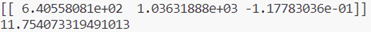

# Homework 2 Implenmentation of Logistic Regression

Firstly, write the dataset into `data.csv`, and read from it, using `panda`. Then using `numpy` to solve this problem. To get the maximal value of the function, I choose the method gradient descent,  with the iteration number 10000 learning rate 0.02.

The code is in `main.py`.

The result of this program is below, which shows the minimal value and the postion of it.

